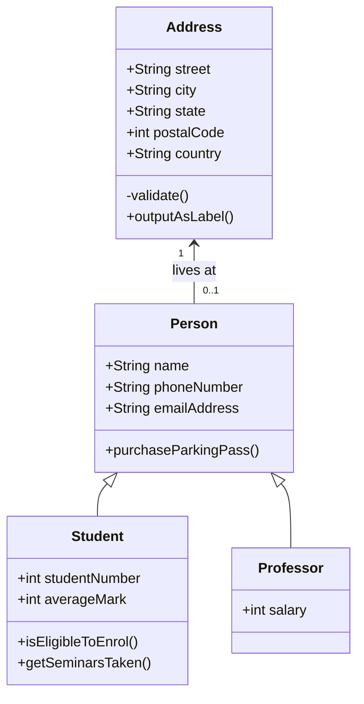
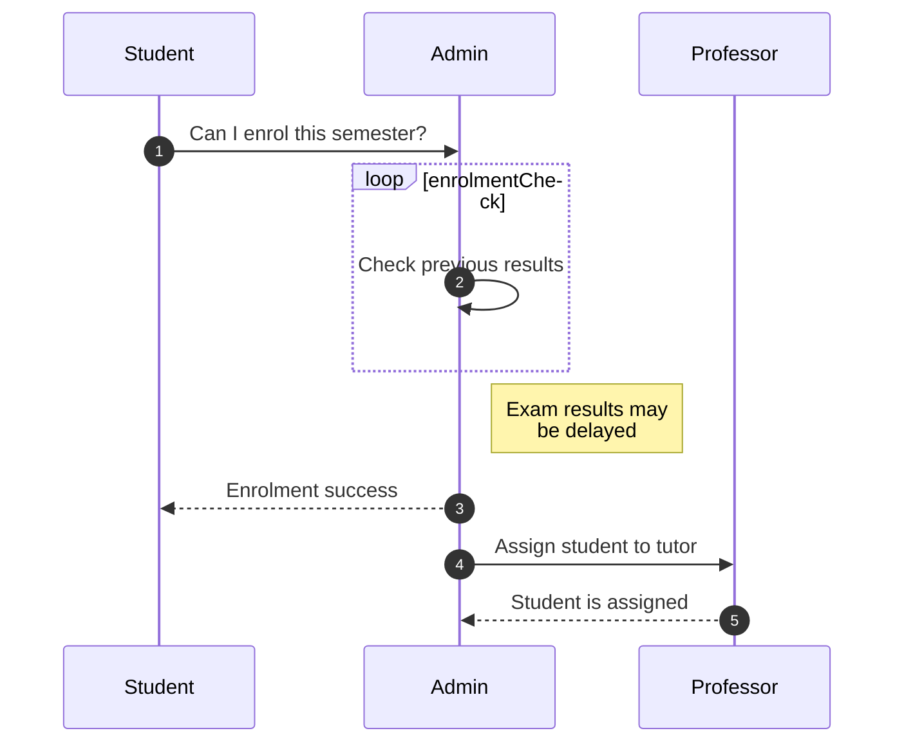

# introduction
this is my orogram
Example:
https://mermaid.live/

# class diagram
here is my diagram

```mermaid
classDiagram
   Person <|-- Student
   Person <|-- Professor
   Person : +String name
   Person : +String phoneNumber
   Person : +String emailAddress
   Person: +purchaseParkingPass()
   Address "1" <-- "0..1" Person:lives at
   class Student{
      +int studentNumber
      +int averageMark
      +isEligibleToEnrol()
      +getSeminarsTaken()
    }
    class Professor{
      +int salary
    }
    class Address{
      +String street
      +String city
      +String state
      +int postalCode
      +String country
      -validate()
      +outputAsLabel()  
    }	
```

# Seqence diagram

```mermaid
sequenceDiagram
    autonumber
    Student->>Admin: Can I enrol this semester?
    loop enrolmentCheck
        Admin->>Admin: Check previous results
    end
    Note right of Admin: Exam results may <br> be delayed
    Admin-->>Student: Enrolment success
    Admin->>Professor: Assign student to tutor
    Professor-->>Admin: Student is assigned
```
